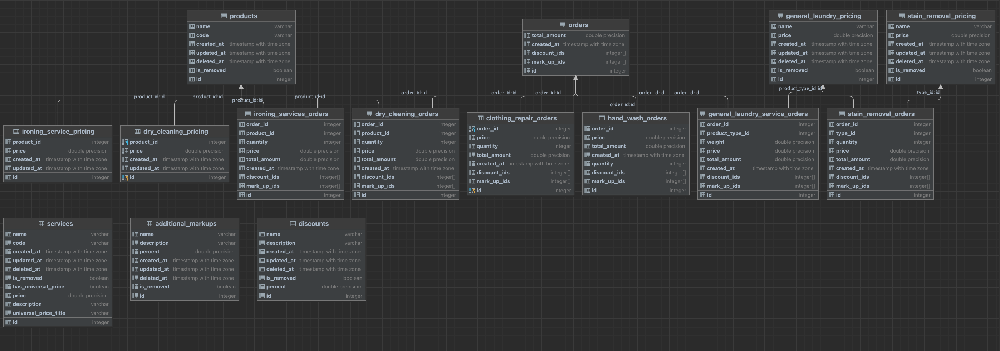

# AutoLaundry

AutoLaundry - система для расчета суммы для оплаты услуг прачечной.
У прачечной есть несколько различных видов оказываемых услуг. 
В зависимости от типа выбранных услуг и количества вещей в килограммах для каждого типа
обслуживания система рассчитывает сумму для оплаты и записывает информацию, которая будет 
суммироваться и генерироваться отчет в конце каждого рабочего дня для целей бухгалтерского учета.

## Стек технологий

- Golang: Gin, Gorm, lumberjack.v2
- Postgres

## Логирование
* В системы реализованы 4 уровня логов:
1. Debug
2. Errors
3. Info
4. Warning

## Возможности

- Получение списка сервисов
- Получение списка подкатегорий и цен каждого сервиса
- Получение списка скидок
- Получение списка наценок
- Создание заказа
- Получение списка заказок с фильтром по дате

## База данных
База данных находится в elephantsql.com. Структура таблиц в бд приведено ниже:

## Запуск приложения

1. Скачайте необходимые зависимости: `go mod tidy`
2. Запустите приложение: `go run main.go`
3. Затем перейдите на страницу Swagger-документации: http://localhost:8181/swagger/index.html#/
* также в репозитории есть postman_collection всех запросов приложения 
